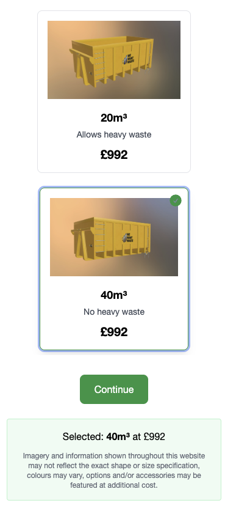

# My Skip App

A responsive React application for selecting skip (container) sizes with real-time data fetched from an API. Built with Vite, React, TypeScript, and Tailwind CSS, the app displays skip options in a horizontally scrollable grid on desktop and vertically scrollable on mobile. Each card shows a photo of the skip, its size, and price (before VAT).

## Features

* **React + TypeScript** for a type-safe UI and codebase.
* **Vite** for fast development and production builds.
* **Tailwind CSS** for utility-first, responsive styling.
* **Custom Hook (`useSkips`)** encapsulates data fetching, loading, and error states.
* **SkipCard** component displays:

  * Skip image loaded from `public/skips/skip-{size}.png`
  * Size label (e.g. `4m³`)
  * Price (before VAT)
  * Selection state with green outline and check icon
* **Responsive Design**:

  * Desktop: horizontal scrolling grid (`overflow-x-auto`).
  * Mobile: vertical scrolling list (`overflow-y-auto`).
* **Dynamic Data**: Fetches skip options from `https://app.wewantwaste.co.uk/api/skips/by-location`.
* **Image Mapping**: Uses `price_before_vat` from the API and maps to `price` field; maps `size` to image filename in `public/skips/skip-{size}.png`.
* **Unit Tests**: Vitest tests for the `fetchSkips` service.

## Screenshot




## Getting Started

### Prerequisites

* Node.js v16+ and npm

### Installation

1. Clone the repository:

   ```bash
   git clone https://github.com/oguzhansaritas/remwaste.git
   cd my-skip-app
   ```

2. Install dependencies:

   ```bash
   npm install
   ```

3. Add skip container images:
   Place images named `skip-4.png`, `skip-6.png`, etc. into `public/skips/` to match API `size` values.

4. Start the development server:

   ```bash
   npm run dev
   ```

5. Open [http://localhost:3000](http://localhost:3000) in your browser.

### Building for Production

```bash
npm run build
npm run preview
```

## File Structure

```
my-skip-app/
├── public/
│   └── skips/
│       ├── skip-4.png
│       ├── skip-6.png
│       └── ...
├── src/
│   ├── components/
│   │   ├── SkipCard.tsx
│   │   ├── SkipGrid.tsx
│   │   ├── Loading.tsx
│   │   └── ErrorMessage.tsx
│   ├── hooks/
│   │   └── useSkips.ts
│   ├── services/
│   │   └── skipApi.ts
│   ├── utils/
│   │   └── format.ts
│   ├── App.tsx
│   ├── main.tsx
│   └── index.css
├── tests/
│   └── skipApi.test.ts
├── package.json
├── vite.config.ts
├── tailwind.config.cjs
└── postcss.config.cjs
```

## Testing

```bash
npm run test
```

## License

MIT © OĞUZHAN SARITAŞ
